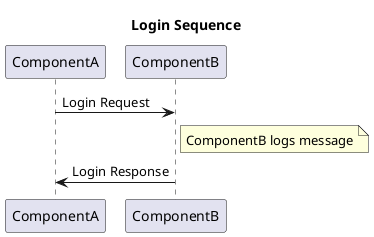

# example docs

This is a basic example of documentation.

Blablabla

```plantuml
@startuml
title Login Sequence
    ComponentA->ComponentB: Login Request
    note right of ComponentB: ComponentB logs message
    ComponentB->ComponentA: Login Response
@enduml
```